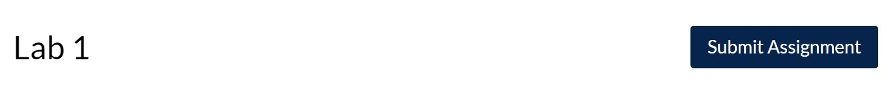
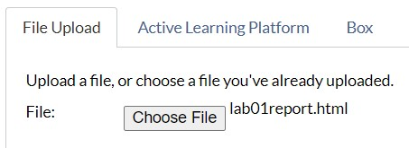

```{r setup, include=FALSE}
knitr::opts_chunk$set(echo = TRUE)
```

# Instructions

Welcome to Lab 1! Complete the following exercises designed to help get you up and running in R and RStudio.

Depending on your instruction method (synchronous or asynchronous), complete the following exercises collaboratively.

1. **Synchronous remote:** You will be placed in a Zoom breakout room to work together in small groups.
1. **Asynchronous remote:** Use Piazza for asynchronous collaboration.

**Collaborators:** If applicable, replace this text with the names of anyone you collaborated with on this project.

## Try It!


> **1.** Which of the variables in `penguins` are *quantitative* (or *numeric*) and which are *categorical*?

  *Answer:*  Replace this text with your answer.


> **2.** Make a bar chart for the number of penguins observed on each island in the Palmer Archipelago. You will need to use the `island` variable in the `penguins` data set. *Hint: you can use existing code from above, and be sure to change the axis labels and title too!* \n
If you have time, play around with the colors! (things like "red", "yellow", "blue" work, but see [here](http://www.stat.columbia.edu/~tzheng/files/Rcolor.pdf) for a list of possible color names in R if you're more adventurous.)

```{r islandPlot, error = T}
# Get started by copying and pasting the code from the speciesPlot chunk above! (Remember that this text is a comment, so it's not run by R; you can delete it if you want.)
```

> **3.** Recreate the numerical summaries for the `bill_length_mm` variable. (*Hint: copy/paste and alter the code from earlier.*) What is the mean (average) bill length?

  ```{r billSummaries, error = T}
# Get started by copying and pasting the code from the flipperSummaries chunk above! (Remember that this text is a comment, so it's not run by R; you can delete it if you want.)
```

*Answer:* Replace this text with your answer to the question about mean bill length.

## Discussion
Each week, this section of the lab will have you dive deeper into the analysis. Maybe you'll discuss a different application, or preview the next week's topic. You'll also have the chance to draw substantive conclusions from your analysis, and to think more deeply about what it is you've just done, and why. *Often, there will not be right or wrong answers here, just like in real-life applications of statistics. These questions are meant to make you think more deeply about what you've just done.*

> Talk About It 1: What's something you learned today? It can be about statistics, R, penguins, or anything else related to STATS 250.

*Write 1-2 sentences about your answer here*

  > Talk About It 2: How do you think statistics can help you in your major or future career?

  *Write 1-2 sentences about your answer here*

  > Talk About It 3: What was the best part of lab for you today? What was a challenging part?

  *Write 1-2 sentences about your answer here*


  ## Wrap-Up and Submission

  At the top of the document, make sure you've changed the `author` field to your name (in quotes!). If you'd like, change the date as well.

When you've finished the lab, click the **Knit** button one last time.<br />


Give yourself a high five - you just wrote code! *Do not violate social distancing guidelines to give anyone else a high five :(*

### Submission instructions
<!-- This is a comment and will not show up in your document. Note that the
numbering here is all 1's. This will automatically be converted to 1, 2, etc.
when you knit the document; writing all 1's makes it so you don't have to
constantly update the numbering when you move things around in editing! -->

  #### If you're using RStudio Cloud
  1. In the Files pane, check the box next to `lab01report.html`: </br>
  
2. Click More > Export... </br>
  
3. Click Download and save the file on your computer in a folder you'll remember and be able to find later. You can just call the file `lab01report.html` or whatever else you'd like (as  long as you remember what you called it). </br>
  

#### If you're using RStudio installed on your computer
1. Locate the `lab01report.html` file on your computer. The file will be saved in the location indicated at the top of the files pane. <br>
  

#### Submission to Canvas

1. Click the "Assignments" panel on the left side of the page. Scroll to find "Lab 1", and open the assignment. Click "Submit Assignment". <br />
  

2. Towards the bottom of the page, you'll be able to choose `lab01report.html` from the folder you saved it in from RStudio Cloud or noted if you're using RStudio Desktop. **You will only be able to upload a .html file -- do not upload any other file type.** <br />
  
3. Click "Submit Assignment". You're done!
