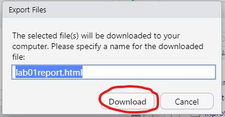

```{r setup, include=FALSE}
knitr::opts_chunk$set(echo = TRUE)
```

# Instructions

Welcome to Lab 1! Complete the following exercises designed to help get you up and running in R and RStudio. It is important that you keep your answers inside the ".answer" blocks. Do NOT delete the three colon blocks (:::) and keep your responses between them. Use the tutorial for help, and feel free

Depending on your instruction method (synchronous or asynchronous), complete the following exercises collaboratively.

1. **Synchronous remote:** You will be placed in a Zoom breakout room to work together in small groups.
1. **Asynchronous remote:** Use Piazza for asynchronous collaboration.

**Collaborators:** If applicable, replace this text with the names of anyone you collaborated with on this project.

# Lab Assignment

## Question 1

:::{.question}
We're going to start by playing a bit with R Markdown. Read carefully through the text below and apply formatting to it as follows:

1. Make the text "Tips and Tricks for R Markdown" bold.
2. Make the text "Knit and knit often" italic.
3. Make the text "Make sure your chunk syntax is correct" italic.
4. Make the text "Be persistent!" bold.
:::

:::{.answer}
Tips and Tricks for R Markdown

1. Knit and knit often. You'll be turning in the knitted HTML document to Canvas for grading, and it's important that you know what it looks like!
2. Make sure your chunk syntax is correct. You should only have one set of opening and closing backticks (```) per chunk!
3. Be persistent! Learning this system takes time, and it's okay if you don't get it right away. Just keep trying, and don't be afraid to ask for help!
:::


## Question 2

:::{.question}
In the chunk below, we import ("read in") the data in `penguins.csv` and call it `pendat`. Change the name of the data to penguins. Then, run the chunk to see what the data look like, and list out the categorical and numeric variables.
:::

:::{.answer}
```{r question2, error = T}
# Change the name of the dataset to penguins
pendat <- read.csv("penguins.csv")

# Now, let's look at the first 6 rows of the data
head(penguins)
```

The categorical variables in the data are:

The numeric variables in the data are: 

:::


## Question 3

:::{.question}
Use R as a calculator to compute the following values. Assign the first value the name `x`, the second value the name `y`, and the third `z`.
$$\frac{27}{2 + 3^2}$$
$$\frac{1}{3} + \frac{1}{5} \times 0.257$$
$$92^3 - 734$$
:::


:::{.answer}
```{r question3, error = T}
# Use this code chunk to write the code necessary to answer the question. Do not start your code on this line, and do not start your code with # (this is a comment, R will ignore it).

```
:::

## Question 4

:::{.question}
(a) What's something you learned in this lab?
:::

:::{.answer}
Write 1-2 sentences for your answer here.
:::

:::{.question}
(b) What's something you struggled with in this lab? How do you plan to improve?
:::

:::{.answer}
Write 1-2 sentences for your answer here.
:::

:::{.question}
(c) What was the best part of this lab for you?
:::

:::{.answer}
Write 1-2 sentences for your answer here.
:::


<hr />
# Wrap-Up and Submission

At the top of the document, make sure you've changed the `author` field to your name (in quotes!). If you'd like, change the date as well.

When you've finished the lab, click the **Knit** button one last time.<br />


Give yourself a high five - you just wrote code! *Do not violate social distancing guidelines to give anyone else a high five :(*

### Submission instructions
<!-- This is a comment and will not show up in your document. Note that the
numbering here is all 1's. This will automatically be converted to 1, 2, etc.
when you knit the document; writing all 1's makes it so you don't have to
constantly update the numbering when you move things around in editing! -->

  #### If you're using RStudio Cloud
  1. In the Files pane, check the box next to `lab01report.html`: </br>
  
2. Click More > Export... </br>
  
3. Click Download and save the file on your computer in a folder you'll remember and be able to find later. You can just call the file `lab01-report.html` or whatever else you'd like (as  long as you remember what you called it). </br>
  

#### If you're using RStudio installed on your computer
1. Locate the `lab01report.html` file on your computer. The file will be saved in the location indicated at the top of the files pane. <br>
  

#### Submission to Canvas

1. Click the "Assignments" panel on the left side of the page. Scroll to find "Lab 1", and open the assignment. Click "Submit Assignment". <br />
  

2. Towards the bottom of the page, you'll be able to choose `lab01-report.html` from the folder you saved it in from RStudio Cloud or noted if you're using RStudio Desktop. **You will only be able to upload a .html file -- do not upload any other file type.** <br />
  
3. Click "Submit Assignment". You're done!
