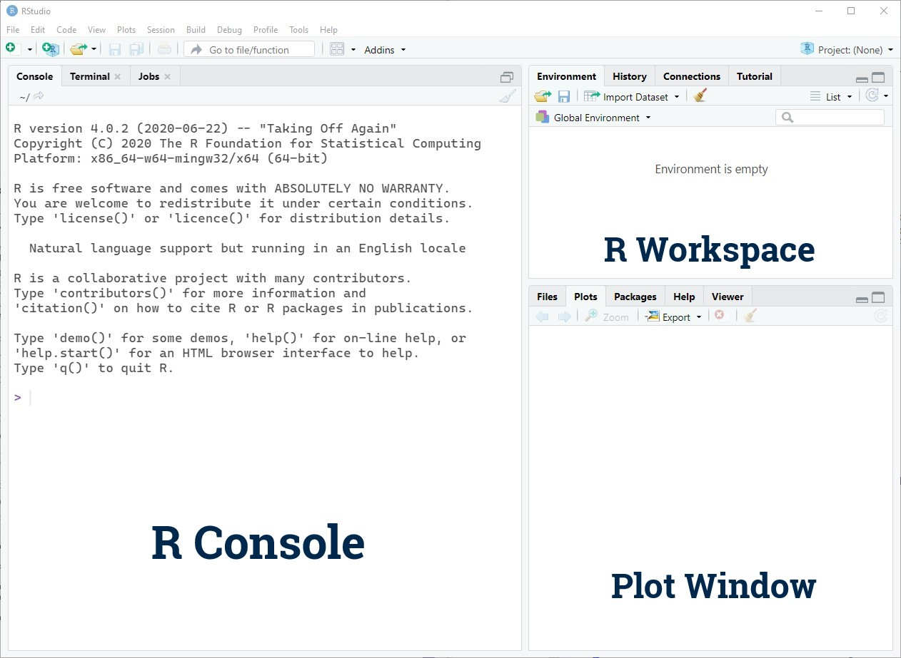
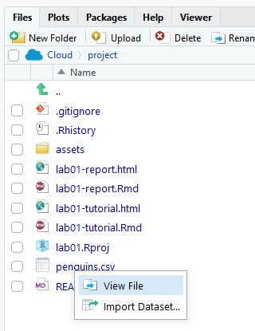

```{r setup, include=FALSE}
knitr::opts_chunk$set(echo = TRUE)
```

# Learning Objectives

## Statistical Learning Objectives
<!-- This is a comment and will not show up in your document. Note that the
numbering here is all 1's. This will automatically be converted to 1, 2, etc.
when you knit the document; writing all 1's makes it so you don't have to 
constantly update the numbering when you move things around in editing! -->
1. Visualize categorical data
1. Summarize quantitative and categorical data

## R Learning Objectives
1. Learn the difference between R, R Studio, and R Markdown
1. Become familiar with the R Studio interface 
1. Understand key components of an R Markdown document
1. Become familiar with R functions and arguments

## Functions covered in this lab
1. `head()`
1. `barplot()`
1. `summary()`

# Lab Tutorial

## Getting Started: What is R?
In Statistics, we often use computers to analyze data. There are a lot of programs that can help you do statistical analyses. One of the most popular (and powerful) is called R. R is a "statistical computing environment" that is designed for manipulating data, doing calculations, and making graphical displays. R works by writing **R code**.

That might sound scary, but *don't worry*: this is not a programming class. Over the course of the semester, you'll learn how to edit and write some basic R code to help you analyze data to answer research questions. Our goal in lab is to help you learn the basics of R and R coding, but through the lens of answering statistical questions. 



### What are all these "R" terms?
There are a lot of "R" words floating around. What's going on?

- *R* is a "statistical computing environment" that's designed for manipulating data, generating plots, and performing analyses. It's also a programming language. You'll be *using R* this semester.
- *R Studio* is an "integrated development environment (IDE)" for R (you'll never have to hear the term IDE again in this class). Basically, it's a pretty interface that makes working with R easier. You use R inside of R Studio. If R is ice cream, R Studio is the cone or cup.
- *R Markdown* is a way to write pretty analysis reports that combines R code, R output (plots, analysis results, etc.) and text in one document. This lab document is an R Markdown report!

## R Markdown

This is an R Markdown document. R Markdown lets you combine text, R code, and plots in one pretty, reproducible report. If you're curious about this, you can find more details on using R Markdown at <http://rmarkdown.rstudio.com>.

R Markdown runs code contained in "chunks". A chunk looks like this:
```{r helloWorld} 
print("Hello world!")
```

Notice that the code, `print("Hello world!")` is contained between three backticks (```, right below the esc key on a US English keyboard) -- this is how R Markdown knows where your chunks start and stop. You can just run a single chunk by clicking the green "play" button in the upper right corner of the chunk.

When you click the **Knit** button in R Studio, a document will be generated that includes both content as well as the output of any embedded R code chunks within the document. 

### Tips for R Markdown
1. **Knit and knit often**: Frequently knitting your document will help you make sure that all your code works and that the document looks the way you want.
1. **Don't be afraid to experiment**: Nobody gets things exactly right the first time, and we all forget how things work sometimes. Keep trying, and you'll eventually get what you want!
1. **Formatting**: You can make text **bold** by surrounding it with two asterisks (`**`) and *italic* by surrounding it with one asterisk (`*`).

## Using R as a Calculator
At it's most basic, R is a fancy calculator. 

TODO: RUN ALL CHUNKS ABOVE
Remember, you can run the code in this chunk by clicking the green "play" button in the upper right corner of the chunk. 
```{r calculatorExample}
5 * 7
```
When you run the chunk, you'll see a `[1]` before the output of `35`. *Just ignore this. The result is `35`.*

All of the symbols you think you'd use to do math work: + for addition, - for subtraction, * for multiplication, / for division, ^ for exponentiation.

**Try it yourself!**
In the chunk below, compute 50 divided by 9. You'll notice the chunk contains the text `# Write code here!`. This is called a "comment" -- it's not code that R runs, it's just there to explain your code. Feel free to delete and replace it, or start a new line and type there. See what happens!
```{r tryItCalculator, error = T}
# Write code here! This text is a comment, so it's not run by R. Replace it with code to compute 50 divided by 9.

```

## R Function Syntax
We'll be using R primarily through the use of *functions*. A function generally looks something like this: 

```{r genericFunction, eval = F}
function.name(argument1, argument2, ...)
```

Notice that we have the name of the function, followed immediately by an open parenthesis `(` without a space, then a sequence of *arguments* to the function, separated by commas `,`. 

## R "Assignment" Syntax

Often, we want R to remember the results of a calculation so that we can use it later. We can give the result of some code a name by **assigning** it to something.

```{r assignmentDemo}
x <- 36 / 6
```

We read that code as "x *gets* 36 / 6". The arrow is made using the less-than symbol (`<`, shift + comma on a US English keyboard) and a hyphen.

Now, we've stored the result as `x`, and R will remember that `x` is 6. You can see in the environment pane in R Studio (top right) that there's now a "value" called `x` and it's 6. You can also access the value of `x` by typing `x` into R. Check it out:
```{r x}
x
```

**NOTE:** R is "case-sensitive", which means that upper-case letters are *different than* lower-case letters. Notice what happens when we ask R for the value of `X`:

```{r X, error = T}
X
```

When giving things names in R, you can only use a combination of letters, numbers, periods, and underscores, and the names have to start with a letter or a period. People tend to use underscores or periods instead of spaces.

Watch what happens when you try to assign something to a "bad" name:
```{r badName1, error = T}
tik tok <- 12
```

```{r badName2, error = T}
4eva <- 4 * 2 
```

```{r badName3, error = T}
_hi_mom <- 5^2
```

The errors saying "unexpected symbols" or "unexpected input" are R's way of telling you that these names are not allowed, and that you should use a different name. Here's how we'd correct these:
```{r goodNames}
tiktok <- 12
forever <- 4 * 2
dear_mother <- 5^2
```

## CSV files: a common way to store data

CSV stands for "comma separated values" and is a commonly used file type for storing data. 
Open the file "penguins.csv" from the files pane (lower right) to see what a .csv file looks like:



Each row of the file is an "observation" or "case", and consists of one or more variables whose *values* are *separated* by *commas* (hey, look at that). The first row contains the names of the variables contained in the file.

### Palmer Penguins Data
We're going to start by working with a data set with data on 333 penguins collected from 3 islands in the Palmer Archipeligo in Antarctica. Data were collected and made available by [Dr. Kristen Gorman](https://www.uaf.edu/cfos/people/faculty/detail/kristen-gorman.php)
and the [Palmer Station, Antarctica LTER](https://pal.lternet.edu/), a member of the [Long Term Ecological Research Network](https://lternet.edu/), and the data were prepared by [Dr. Allison Horst](https://github.com/allisonhorst/palmerpenguins).


We can **read** data into R using a function called `read.csv()`. The first argument to `read.csv()` is the name of a .csv file (here, `penguins.csv`), in quotes. We then store the results of `read.csv()` as an object called `penguins`.

```{r readData}
penguins <- read.csv("penguins.csv", stringsAsFactors = FALSE)
```

Let's see what's in the data. We can peek at the first few (6, specifically) rows of the data using the `head()` function:
```{r headPenguins}
head(penguins)
```
We read that line as "*head* of *penguins*". Remember that `penguins` is what we named our data set. We can see that `penguins` contains a number of *variables*, like `species`, `island`, and more. 

| Variable name | Description |
|:--------------|:------------|
|`species`| Penguin species (Ad&eacute;lie, Chinstrap, and Gentoo) |
|`island`| Island in Palmer Archipeligo, Antarctica, on which the penguin was observed (Biscoe, Dream, or Torgersen) |
|`bill_length_mm`| A number denoting bill length (in millimeters) |
|`bill_depth_mm`| A number denoting bill depth (in millimeters) |
|`flipper_length_mm`| A whole number denoting flipper length (in millimeters) |
|`body_mass_g`| A whole number denoting penguin body mass (in grams) |
|`sex`| Penguin sex (female, male) |
|`year`| Study year (2007, 2008, 2009) |

